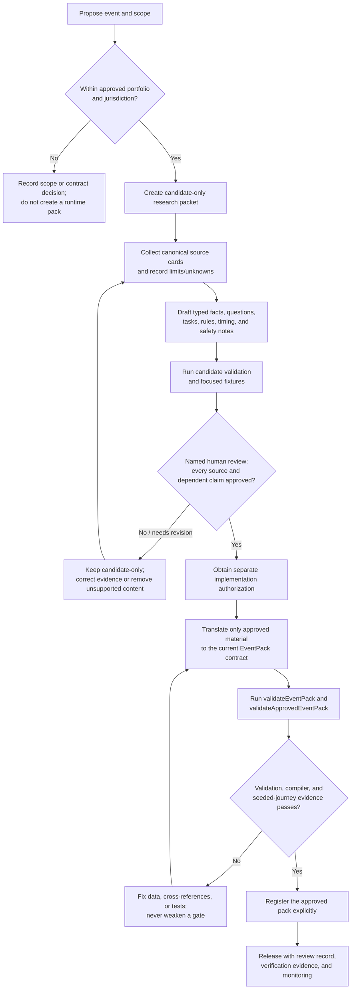

# Adding a Life Navigator event pack

This guide explains how to add a new Life Navigator event pack without turning
research, model output, or unreviewed policy material into user-facing advice.
An event pack is a versioned catalog of facts, questions, source cards, tasks,
rules, timing, and safety metadata. The deterministic roadmap compiler—not a
model or UI code—uses that catalog to select a roadmap.

This is a controlled, three-stage process:

1. **Candidate research and curation** — evidence-backed draft material only.
2. **Human review and approval** — dated decisions on sources and dependent
   content.
3. **Approved-pack implementation** — validated runtime catalog data, tests,
   and explicit registration.

Candidate material must never be registered, compiled, or rendered as a
roadmap. A separate implementation authorization is required after approval.

## Process at a glance

## 1. Establish the scope before researching

Confirm that the proposal fits the current product boundary: Israel-first,
English-only, educational planning support, and no eligibility determination or
external action. Record the intended event, user need, jurisdiction, language,
and known unknowns.

If the event needs a new canonical event ID, a new jurisdiction profile, or a
contract capability that does not exist, stop here. Obtain the relevant product
and architecture decision first. Do not add an ID to the registry, a
user-selectable route, or the runtime `EventId` contract simply to begin
research.

## 2. Create a candidate-only packet

Use the repository-local
[`life-event-authoring`](../.agents/skills/life-event-authoring/SKILL.md) skill
and its templates to create a reviewable packet under `docs/candidates/` (or
another clearly non-runtime location). Mark every document `candidate_only` /
`needs_human_review`.

The candidate packet should contain:

- an event proposal with a narrow scope and explicit non-goals;
- an evidence ledger and one candidate source card per prospective source;
- typed draft facts and transition gates;
- a minimal, decision-changing question set;
- candidate task templates, typed timing, rule proposals, dependencies, source
  references, verification labels, and safety notes;
- deterministic fixtures and a test plan where they help prove a rule or
  transition boundary; and
- a reviewer gate with named owners, dates, dispositions, uncertainties, and
  implementation authorization status.

AI-assisted research may summarize supplied material and draft proposals, but
it is non-authoritative. It must not activate content, decide eligibility, or
invent sources, deadlines, rules, or claims.

## 3. Curate evidence and source cards

Collect canonical, authoritative sources before writing policy-dependent tasks.
Each candidate source card must include a stable ID, title, publisher,
canonical URL, access date, review date, supported-claim summary, applicable
event/task IDs, limitations, review owner, and review status.

Keep the scope of each claim narrow. If a source does not establish a claim,
record `unknown`; do not bridge the gap with inference. High-stakes content must
be phrased as a verification prompt until a human reviewer approves the source
and its dependent wording.

## 4. Author catalog-shaped, decision-changing content

Draft against the current Zod/TypeScript event-pack contracts rather than
inventing a per-event schema. The approved implementation must provide stable
IDs and valid cross-references for facts, questions, tasks, rules, timing,
source cards, safety metadata, and demo scenarios.

Questions are justified only when their answer changes at least one of task
selection, timing, ordering, wording, verification state, or a documented
follow-up. Skip and unknown answers remain unknown.

For a task that depends on a real-world transition, require an explicitly
confirmed typed fact in its applicability rule. A date, estimate, schedule,
elapsed time, or model inference never proves that transition occurred.

## 5. Obtain human review before implementation

The project owner or designated human reviewer must give every candidate source
card a dated disposition: `approved`, `rejected`, or `needs_review`. Review
also covers the source-backed tasks, rules, questions, timing, safety copy, and
unresolved eligibility or dependency ambiguity.

The gate remains closed when any required source is rejected or needs review,
a claim is unsupported, a reviewer/date is missing, or no separate
implementation authorization exists. Remove or revise the dependent material;
do not route around the gate with source-free policy language.

## 6. Implement only the approved catalog

Create the runtime event-pack module in the repository’s current
`src/event-packs/` convention. Translate only the approved subset of the
candidate packet into the existing `EventPack` contract. Keep review-only
metadata—such as access scheduling and candidate limitations—outside runtime
source cards unless a separate contract decision approves it.

The runtime implementation must:

- use approved source cards with reviewer, review date, disposition, scope, and
  supported-claim metadata;
- declare `baseTaskIds` and valid typed conditions/rules;
- use catalog-owned timing labels and verification labels;
- keep local user progress outside compiler inputs and pack data;
- expose only allowlisted questions and fact values to the AI boundary; and
- leave task/source/timing/eligibility-adjacent selection to the deterministic
  compiler.

Registration is deliberate. Add a pack to `activeEventPacks` only after it
passes the approved-pack gate. Candidate and `testOnly` packets must stay out
of the runtime registry.

## 7. Validate, test, and release

Run the validator gates in order:

1. `validateEventPack` checks schema shape and cross-references.
2. `validateApprovedEventPack` also rejects non-approved source cards.
3. Focused Vitest coverage proves task selection, timing, source references,
   unknown-fact behavior, transition gates, and explainable diffs.
4. Seeded Playwright coverage exercises confirmation, decision-changing
   questions, the roadmap, task details, and safe degraded states.
5. Run repository release checks: `git diff --check`, typecheck, lint, unit
   tests, build, and relevant end-to-end tests.

Document the reviewer decision, validation evidence, and remaining limitations.
Use a separate, reviewed change to update project records or release state when
needed.

## Required boundaries

- Do not add a bespoke page, prompt chain, or event-specific UI condition in
  place of an event-pack rule.
- Do not use raw model prose as a task, source, timing, safety label, or
  eligibility outcome.
- Do not expose candidate content in a user-facing route, classifier candidate
  list, registry, compiler input, or seeded demo.
- Do not add live web retrieval, a database, authentication, integrations, or
  autonomous actions as part of pack authoring.
- Do not convert uncertain, skipped, or absent facts into negative facts.

## Related repository references

- [Event-pack authoring and source-review workflow](event-pack-authoring.md)
- [Life-event authoring skill](../.agents/skills/life-event-authoring/SKILL.md)
- [Trust, safety, and source instructions](instructions/trust-safety-and-sources.md)
- [ADR 0002: event-pack contract and deterministic compiler](adr/0002-event-pack-contract-and-roadmap-compiler.md)
- [Technical and product direction](technical-product-direction.md)
